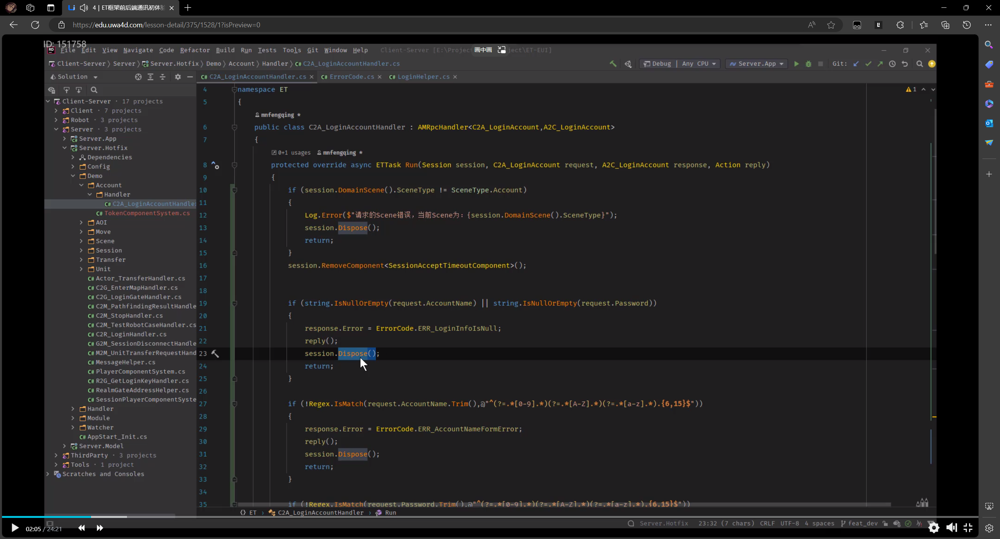
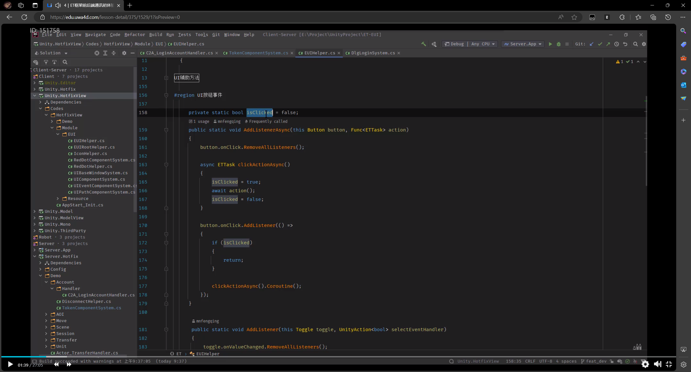
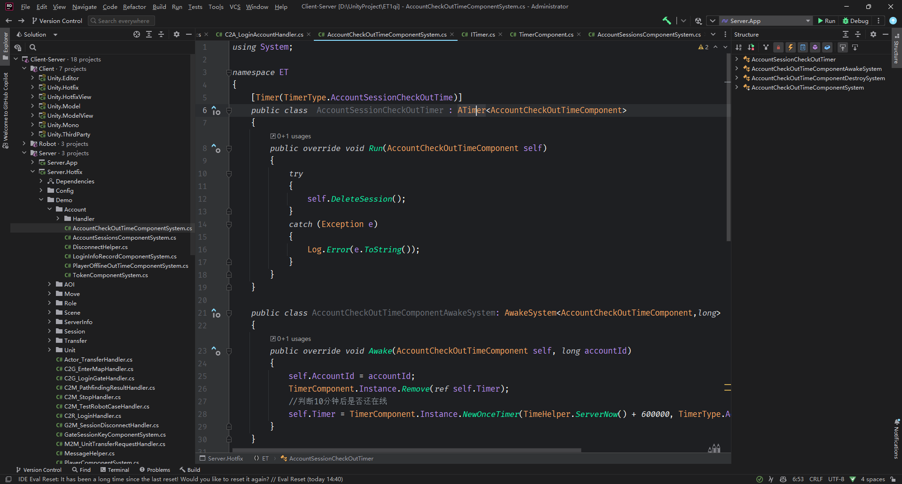
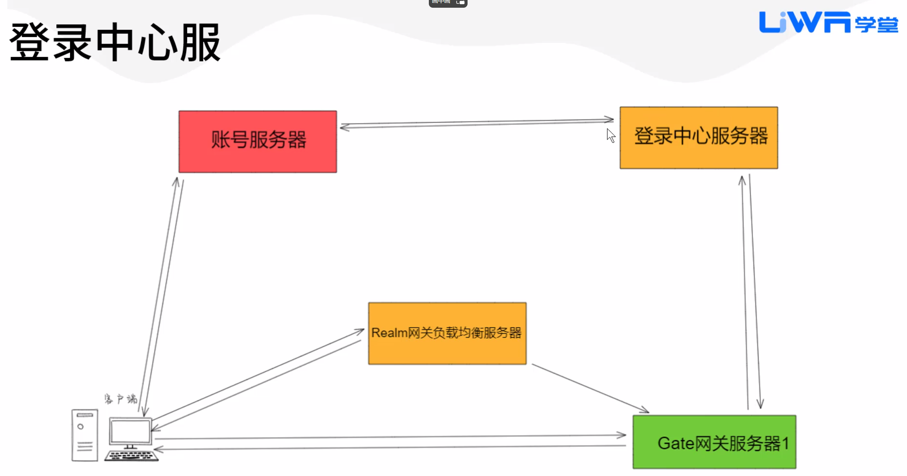
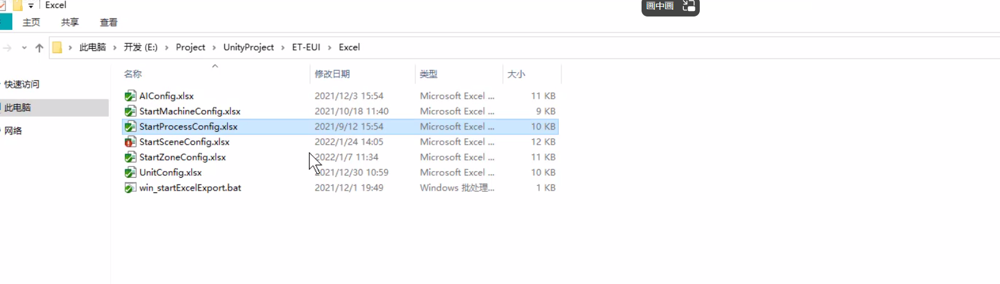
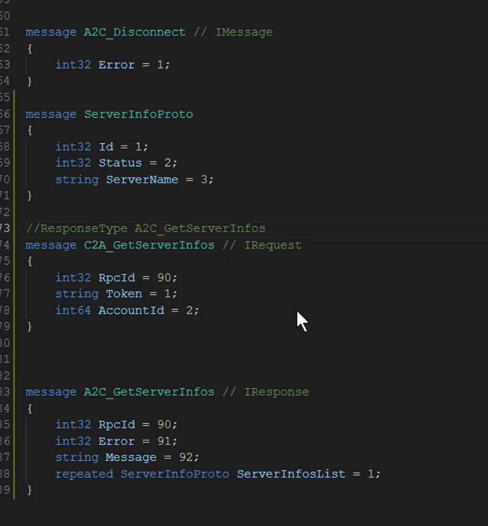
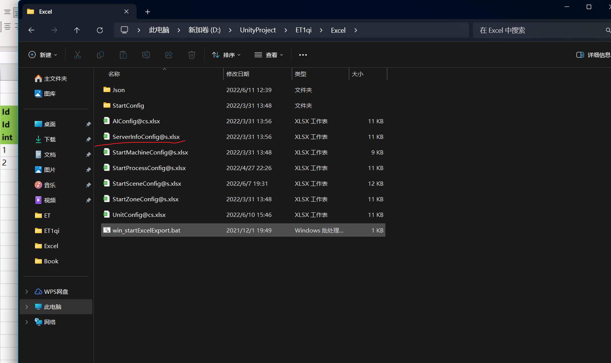
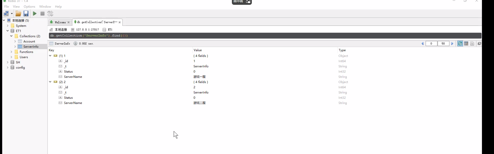
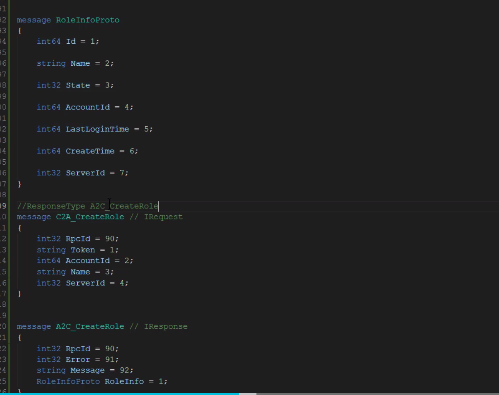

# et进阶

https://edu.uwa4d.com/course-intro/1/377?purchased=false

1-3 UnitCache缓存服

5 

# et介绍

## 课程地址

[4｜ET框架前后端通讯初体验_【ET 6.0版本】ET框架 - C#全栈式网络游戏开发框架_UWA学堂 (uwa4d.com)](https://edu.uwa4d.com/lesson-detail/375/1514/1?isPreview=0)


Session类似一个手机


TChannel封装Socket,将回调push到主线程处理

## 游戏服务器架构


### 为什么要增加Gate网关进程？

希望游戏服务器进程只关注业务处理，如果没有网关，服务器进程要管理大量socket连接，还要进行IO读写，效率低

游戏数据库代理进程也是取代之前服务器进程的工作

### 无缝地图架构

服务器进程之间可相互通信


### 登录流程


Gate并不知道玩家在哪个地图，需要借助Location


### 组件式架构


##  ECS


实体即组件，组件即实体

ET6中组件也要继承Entity


Scene中[ChildType]表明所拥有的子实体

实体创建放在UnitFactory，利用Switch判别类型添加不同种类组件

实体生命周期实现需要让实体继承 IAwake , IUpdate


## Scene层级


### 客户端层级

ZoneScene挂载在Game.Scene 

CurrentScene挂载在ZoneScene

如果想踢玩家下线，可以把ZoneScene释放，在创建一个新的ZoneScene，可轻松实现断线重连

关卡切换可释放创建CurrentScene

1. 最经常拿到的还是通过Domin获取ZoneScene


#### AddChild能添加多个，AddComponent只能一个 


demo中没有涉及到CurrentScene


### 服务器端层级

客户端基本只有一个ZoneScene（只有一个游戏进程）

服务端可以以多进程形式，可创建多个不同功能的ZoneScene，它们可相互通信，部署在不同服务器上


#### 创建新的ZoneScene

需要在Excel中的配置中更改，并点击bat


### 机器人层级

服务端操作逻辑层Unit.Hotfix/Unit.Model 实现机器人

前后端一致的好处

分好逻辑表现层的好处


```cs
self.DomainScene();//获取当前实体的ZoneScene
```

## Excel配置

#符号表示不生成


配置是用proto生成的二进制文件

### c和s表示客户端和服务器专用的字段


前面加c表明生成的对象只存在c中


### 分类


### 明文配置


### 生成代码位置


### 生成的类是partial

可以扩展成员和方法，方法写在对应Category中


### 加载数据

```cs
UnitConfig config = UnitConfigCategory.Instance.Get(1001);
Log.Info($"UnitConfigCategory.Instance.Get(1001): {JsonHelper.ToJson(config)}");
var allUnitConfig = UnitConfigCategory.Instance.GetAll();
foreach (var unitConfig in allUnitConfig)
{
    Log.Info($"UnitConfigCategory.Instance.GetAll(): {JsonHelper.ToJson(unitConfig)}");
}
```

### 支持的数据类型修改位置


### 兼容unity的类型

因为引用了相应的库


## 事件


### 位置


Model和Hotfix不能引用unity类型

### 如果事件中想使用uniy类型

在ModelView中也创建一个EventType类保证同一命名空间就行


## ETTask


ETTask是轻量级的Task只支持单线程逻辑，ET设计思路是多进程单线程

如果使用Task会涉及到多线程逻辑，不利于开发

ETTask更安全，无GC


带有返回值的ETTask一般不进行Corotine，如果是逻辑应该有问题

## Proto


OutMessage 客户端发送给服务端的消息，同样也是服务端发送给客户端的消息，直连

InnerMessage 服务器内部相互通信

MongoMessage 服务器内部相互通信 区别在于消息中是否包含实体

字典不支持，用两个List代替吧

等号后要留有空格


### 生成代码位置


经过Gate转发的消息叫做ActorLocation消息


### 消息注释

经过Gate转发的消息叫做ActorLocation消息 用// IActorRequest

RpcId变量 表明需要回复

不需要回复的用 // IMessage

//ResponseType G2G_LockResponse


### Run方法

reply（）回复给客户端


## Actor消息

### 登录流程的更新

更新后是在Gate网关服务器上创建Unit


### Actor模型

取代锁机制

Actor就是添加了MailBox的实体


进程和进程之间的Actor通信

IActorRequest表明这个消息是由一个实体或者说Actor发送到另一个进程或本进程的实体


### ActorLocation消息

ID相当于身份证号，身份证号不变

InstanceId相当于居住地址，会随着搬迁改变

ActorLocation消息会查询定位服务器，进行发送

一般用于客户端与Map服务器上的实体通信，还有Unit相互通信


## 准备工作


```
M2M_UnitTransferRequestHandler	//将一个unit对象传送到Map服务器上的逻辑，是从Gate传送到Map的逻辑
```


同步位置表现都是通过事件分发，通知UnityHotfixView


## 登录请求逻辑编写

### FriendClass

对实体public成员赋值

```
[FriendClass(typeof(Account))]
```

### ChildType

当前父实体要管理哪些子实体


reply（）后session不能直接Dispose（），session reply（）是有延迟的



### 协程锁锁的是异步逻辑


### Unity.HotFixView不能保留任何的字段

这样写就是错的，可存在ModelView中，这样热重载时才不会出现错误




### Timber

要继承这个ATimer




## 登录中心服逻辑

A登录后，B又登录

需要把A踢下线，并与Gate网关服务器断开连接，借助登陆中心服务器




```c#
case SceneType.LoginCenter:
    scene.AddComponent<LoginInfoRecordComponent>();
```


不需要为LoginCenter服配置外网端口,内网端口统一




## 获取服务器列表


玩家登录会看到游戏区服列表

上次看到22----7

ServerInfo已经定义过，这里命名为ServerInfoProto

### 创建对应的Excel文件



商业管理有GM后台管理区服配置



## 角色上线

类似与请求服务器列表信息



到24


## 开启clash后git仍然连接超时问题

[ComponentOf]指明挂载在哪一个组件

```c#
git config --global http.proxy http://127.0.0.1:7890

git config --global https.proxy https://127.0.0.1:7890
```


https://zhuanlan.zhihu.com/p/652905080
